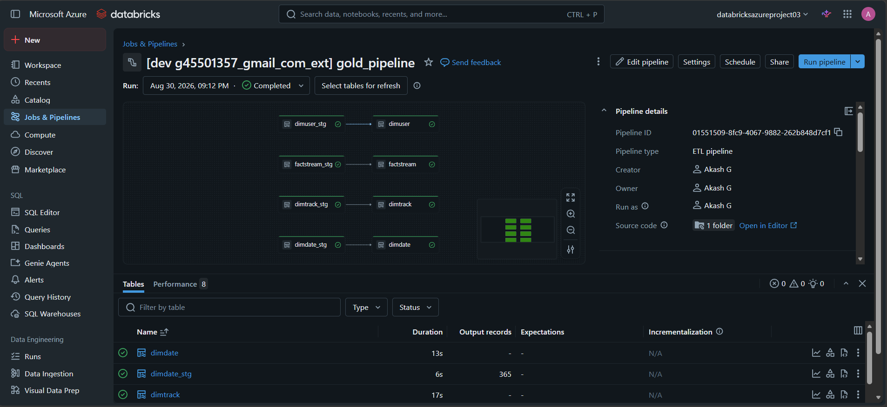
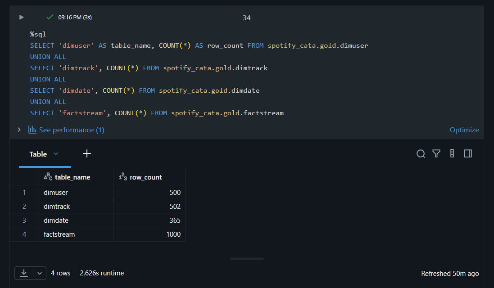

# Spotify Azure Data Engineering Project

An end-to-end Azure data engineering pipeline built to practice production-style ingestion, orchestration, and transformation patterns using a Spotify-style dataset — CDC-based incremental loading, medallion architecture, streaming transformations, and Slowly Changing Dimensions.

## Architecture

```
Azure SQL DB ──▶ Azure Data Factory ──▶ ADLS Gen2 (Bronze)
                (CDC + watermark              │
                 incremental load)             ▼
                                    Databricks Auto Loader
                                       (streaming ingest)
                                                │
                                                ▼
                                    Delta Lake — Silver layer
                                                │
                                Lakeflow Declarative Pipelines
                                  (streaming + Auto CDC / SCD2)
                                                │
                                                ▼
                                    Delta Lake — Gold layer
                                    (star schema: dims + fact)
```

## Repo Structure

| Folder | Contents |
|---|---|
| `/dataset`, `/factory`, `/linkedService`, `/pipeline` | Azure Data Factory — CDC ingestion, watermark incremental pattern, backfill pipelines |
| `/databricks/spotify_dab` | Databricks Asset Bundle — Lakeflow Declarative Pipelines, Unity Catalog gold layer, SCD Type 2 dimensions |
| `/screenshots` | Pipeline runs, DAG lineage, and sample query output |

See each subfolder's own README for full technical detail on that layer.

## Tech Stack

Azure Data Factory · Azure SQL Database · Azure Data Lake Storage Gen2 · Azure Databricks · Unity Catalog · PySpark / Spark Structured Streaming · Lakeflow Declarative Pipelines · Databricks Asset Bundles · Delta Lake

## Screenshots


*Gold layer pipeline — 4 dimension/fact tables running clean*


*Row counts confirming successful full load across all gold tables*
